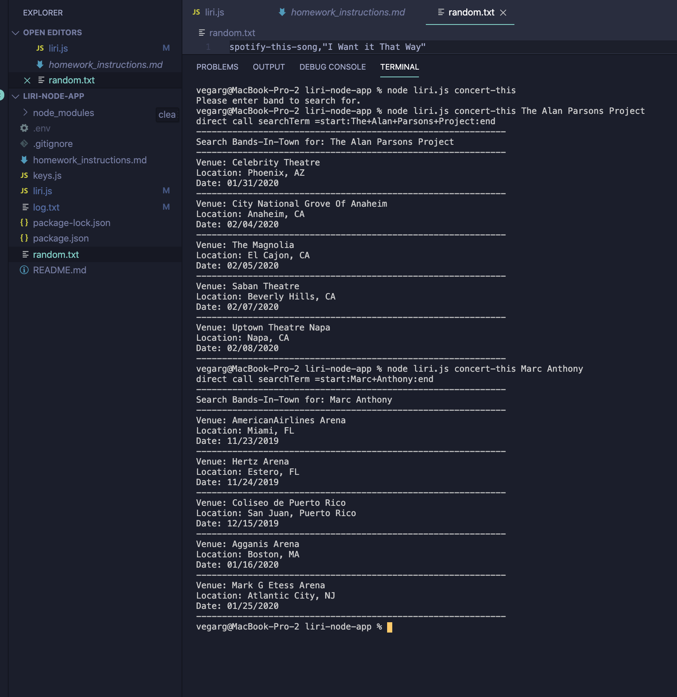
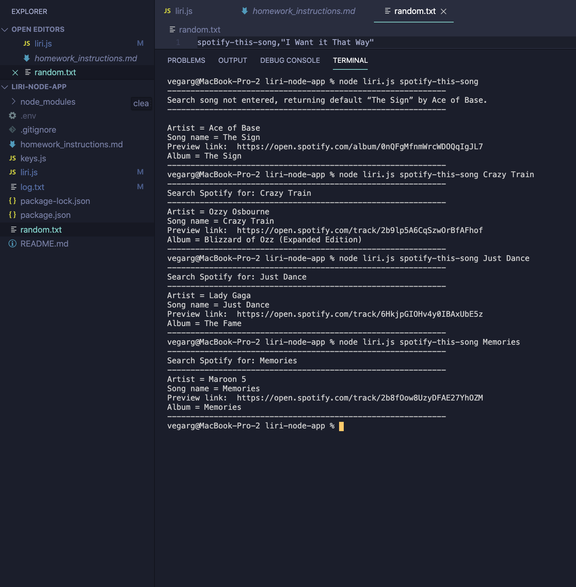
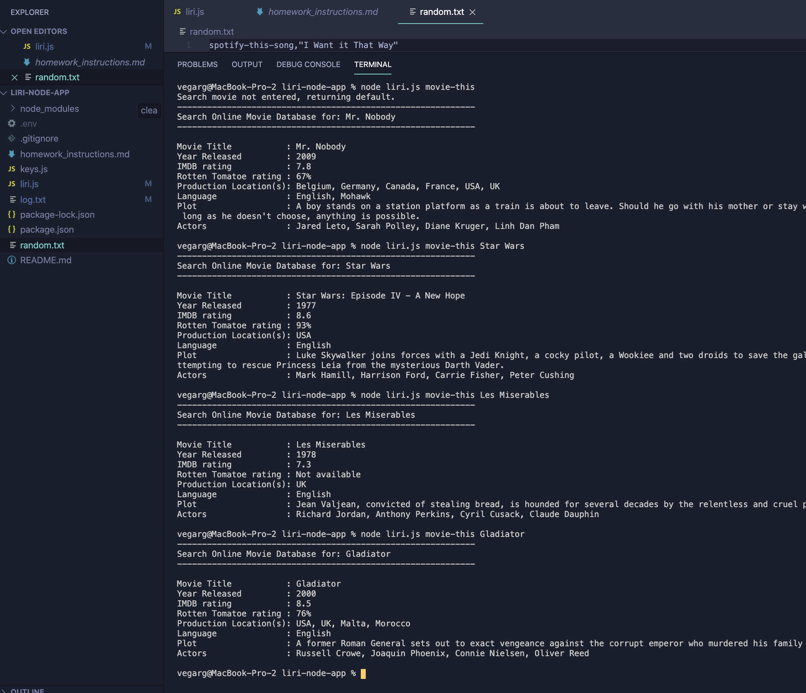
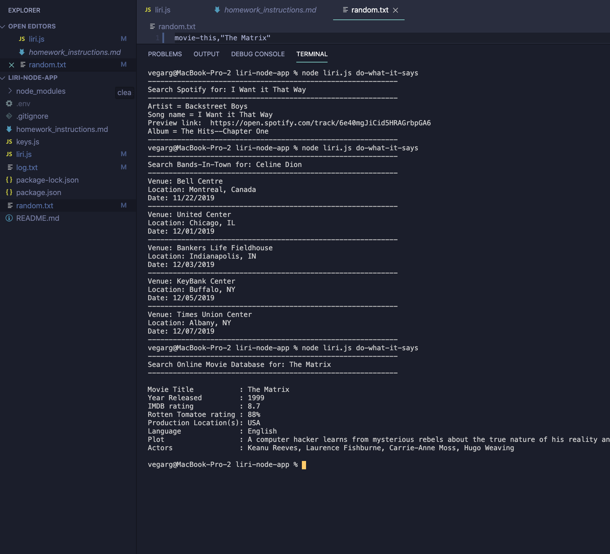
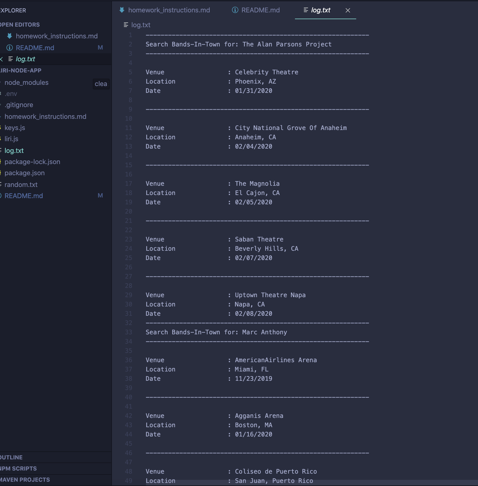

# liri-node-app 
### (Note: this file is mark-down formatted to be read in a code-editor "preview" function or on github)
## Welcome to the readme file for my liri-node app!  This application is available at the following github repository:  

* https://github.com/rgvegajr/liri-node-app


## Background/Purpose:

This command-line application incorporates bands-in-town, spotify, and OMDB APIs/webservices to allow user to search across these services for concerts, music and movies.  The intent is to demonstrate a "siri like" functionality that interprets words (instead of voice commands for siri) and returns results based on user word entry.  The app includes built in defaults and data verification for use cases where either no search parameter is entered or search results in no data returned by the web-service.

## Technologies used:

node.js, with axios, moment, node-spotify-api packages installed.  APIs called by axios include OMDB and Bands-In-Town.  Node-spotify-api calls the spotify api track search endpoint.

## My role:  

I am the app developer.  I used MS Visual Studio Code as my integrated development environment and Github for repository and version control.  Bootcamp instructors provided guidelines, instructions and requirements for this app.

## App Organization:

The code is organized as follows:
1.  Required module import
2.  Global variables declared
3.  User input parsed to support code functionality
4.  Function delcarations for the four sub-applications that make up the liri-node app:

    A. concert-this:  accepts a band/musician name and returns any available concerts (up to 5).  If no concerts exist, the user is notified. If no band is entered, the user is notified. The returned data is as follows: search artist name, venue, location and date

    B. spotify-this-song:  accepts a song/track name and returns data on the first match from spotify.  If song/track does not exist or is not entered, default data is returned.  The returned data is as follows:  search track/song, artist name, song title, spotify preview link (if available) and album name.

    C. movie-this:  accepts a movie name and returns data from Online Movie Database.  If movie doesn't exist or is not entered, the default movie is returned.  The returned data is as follows:  Movie Title, Year Released, IMDB rating, Rotten Tomatoes rating (if available), Production Location(s), Language, Plot, and Actors.

    D. do-what-it-says:  reads a datafile "random.txt" which consists of one of the three above functions, and a search term.  When invoked, this function will run the function and search term included in the random.txt file and return values as per the applicable function (either concert-this, spotify-this-song, or movie-this).

## Instructions (These instructions assume user is familiar with GITHUB and node js and has installed node.js on a PC/Mac):

1.  Open a terminal/bash window on your PC/Mac.
2.  Clone the GITHUB repository for this project from.  Enter into terminal: git clone https://github.com/rgvegajr/liri-node-app.git
3.  Run command "npm i" to install all required packages
4.  Ensure you are in the app folder and create a .env file with your SPOTIFY_KEY and SPOTIFY_SECRET per documentation at https://www.npmjs.com/package/node-spotify-api and https://www.npmjs.com/package/node-spotify-api.  If you don't have a key, the spotify portion of this app will fail. The .env file must include the following lines:

```js
# Spotify API keys

SPOTIFY_ID=your-spotify-id
SPOTIFY_SECRET=your-spotify-secret

```

5.  Enter one of the commands/functions above using the format: node liri.js <function name> <search term>
    examples:  
        Concert search:     node liri.js concert-this Aerosmith
        Song/track search:  node liri.js spotify-this-song just dance
        Movie search:       node liri.js movie-this gladiator
        Do what it says:    node liri.js do-what-it-says  (optional:  bofore running this command, edit and save the random.txt file with desired function & search term.  Format must match the existing random.txt exactly i.e. no spaces allowed)

6.  Results will be displayed in the console/terminal window and will also be appended to a log.txt file in the application folder.  This file is created by node's built-in fs method. 

## Screenshots:

Concert-this:



Spotify-this song:



Movie-this:



Do-what-it-says:



log.txt (sample):




